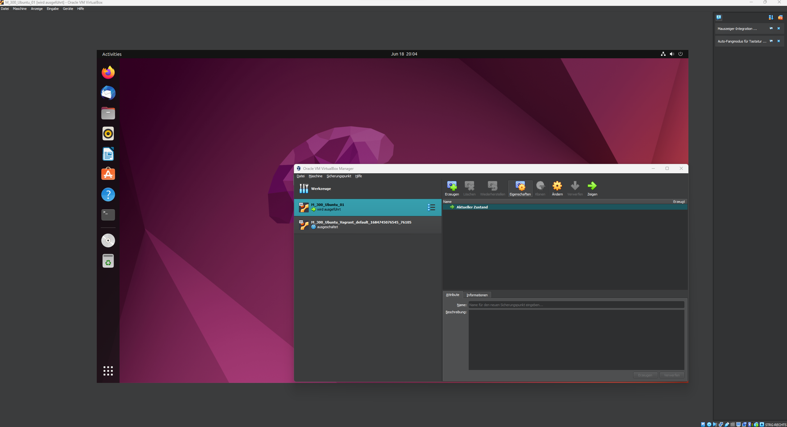
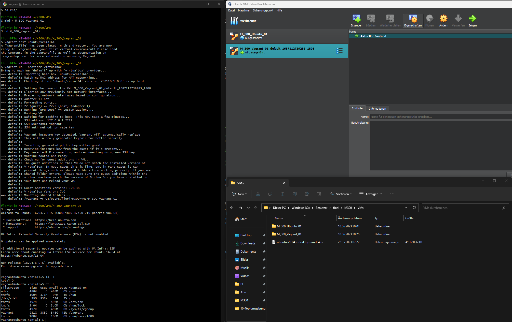
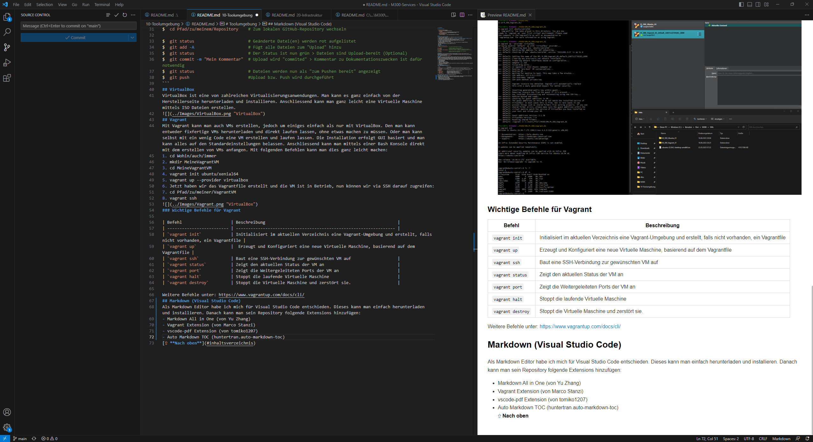

# Toolumgebung

## Inhaltsverzeichnis

- [Toolumgebung](#toolumgebung)
  - [Inhaltsverzeichnis](#inhaltsverzeichnis)
  - [Git](#git)
    - [Installation und Einrichtung](#installation-und-einrichtung)
    - [Wichitge Befehle für Git](#wichitge-befehle-für-git)
  - [VirtualBox](#virtualbox)
  - [Vagrant](#vagrant)
    - [Wichtige Befehle für Vagrant](#wichtige-befehle-für-vagrant)
  - [Markdown (Visual Studio Code)](#markdown-visual-studio-code)

## Git
### Installation und Einrichtung
1. Auf [GitHub](https://www.github.com) anmelden oder einen Account erstellen 
2. Ein neues Projekt erstellen
3. SSH-Key lokal mit folgendem Befehl erstellen: **ssh-keygen -t rsa -b 4096 -C "florian.brus@edu.tbz.ch"**
4. Datei %HOME%/.ssh/id_rsa.pub oder $HOME/.ssh/id_rsa.pub in Zwischenablage kopieren.
5. In GitHub in den Settings den eben kopierten SSH-Key hinzufügen
6. Git Client lokal installieren und mit folgenden Befehlen sein Projekt verknüpfen
- git config --global user.name "username"
- git config --global user.email "e-mail"
7. Anschliessend müssen wir noch unser Repository clonen, dies kann man mit folgenden Befehlen:
- cd Wohin/auch/immer
- git clone https://github.com/flobrus/M300-Services.git
- git pull
- git status
### Wichitge Befehle für Git
```Shell 
$  cd Pfad/zu/meinem/Repository    # Zum lokalen GitHub-Repository wechseln

$  git status                      # Geänderte Datei(en) werden rot aufgelistet
$  git add -A                      # Fügt alle Dateien zum "Upload" hinzu
$  git status                      # Der Status ist nun grün > Dateien sind Upload-bereit (Optional) 
$  git commit -m "Mein Kommentar"  # Upload wird "commited" > Kommentar zu Dokumentationszwecken ist dafür notwendig
$  git status                      # Dateien werden nun als "zum Pushen bereit" angezeigt
$  git push                        #Upload bzw. Push wird durchgeführt
```
## VirtualBox
VirtualBox ist eine von zahlreichen Virtualisierungsanwendungen. Man kann es ganz einfach von der Herstellerseite herunterladen und installieren. Anschliessend kann man ganz leicht eine Virtuelle Maschine mittels ISO Dateien erstellen.

## Vagrant
Mit Vagrant kann man auch VMs erstellen, jedoch um einiges einfach als nur mit VirtualBox. Den man kann entweder fixfertige VMs herunterladen und direkt laufen lassen, ohne etwas machen zu müssen. Oder man kann selbst mit ein wenig Code eine VM erstellen und laufen lassen. Die Installation erfolgt GUI basiert und man kann alles auf den Standardeinstellungen belassen. Anschliessend kann man mittels einer Bash Konsole direkt mit dem erstellen von VMs anfangen. Mit folgenden Befehlen kann man dies ganz leicht machen:
1. cd Wohin/auch/immer
2. mkdir MeineVagrantVM
3. cd MeineVagrantVM
4. vagrant init ubuntu/xenial64
5. vagrant up --provider virtualbox
6. Jetzt haben wir das Vagrantfile erstellt und die VM ist in Betrieb, nun können wir via SSH darauf zugreifen:
7. cd Pfad/zu/meiner/VagrantVM
8. vagrant ssh

### Wichtige Befehle für Vagrant

| Befehl                    | Beschreibung                                                      |
| ------------------------- | ----------------------------------------------------------------- | 
| `vagrant init`            | Initialisiert im aktuellen Verzeichnis eine Vagrant-Umgebung und erstellt, falls nicht vorhanden, ein Vagrantfile |
| `vagrant up`              |  Erzeugt und Konfiguriert eine neue Virtuelle Maschine, basierend auf dem Vagrantfile |
| `vagrant ssh`             | Baut eine SSH-Verbindung zur gewünschten VM auf                   |
| `vagrant status`          | Zeigt den aktuellen Status der VM an                              |
| `vagrant port`            | Zeigt die Weitergeleiteten Ports der VM an                        |
| `vagrant halt`            | Stoppt die laufende Virtuelle Maschine                            |
| `vagrant destroy`         | Stoppt die Virtuelle Maschine und zerstört sie.                   |

Weitere Befehle unter: https://www.vagrantup.com/docs/cli/
## Markdown (Visual Studio Code)
Als Markdown Editor habe ich mich für Visual Studio Code entschieden. Dieses kann man einfach herunterladen und installieren. Danach kann man sein Repository folgende Extensions hinzufügen:
- Markdown All in One (von Yu Zhang)
- Vagrant Extension (von Marco Stanzi)
- vscode-pdf Extension (von tomiko1207)
- Auto Markdown TOC (huntertran.auto-markdown-toc)

[⇧ **Nach oben**](#inhaltsverzeichnis)
[Hier gehts weiter mit meiner Umgebung](20-Infrastruktur/)