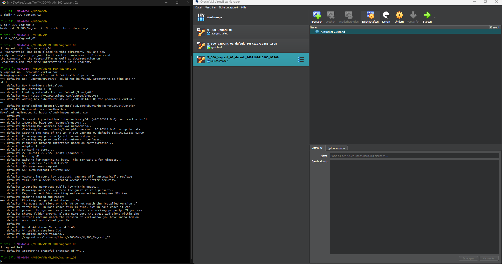
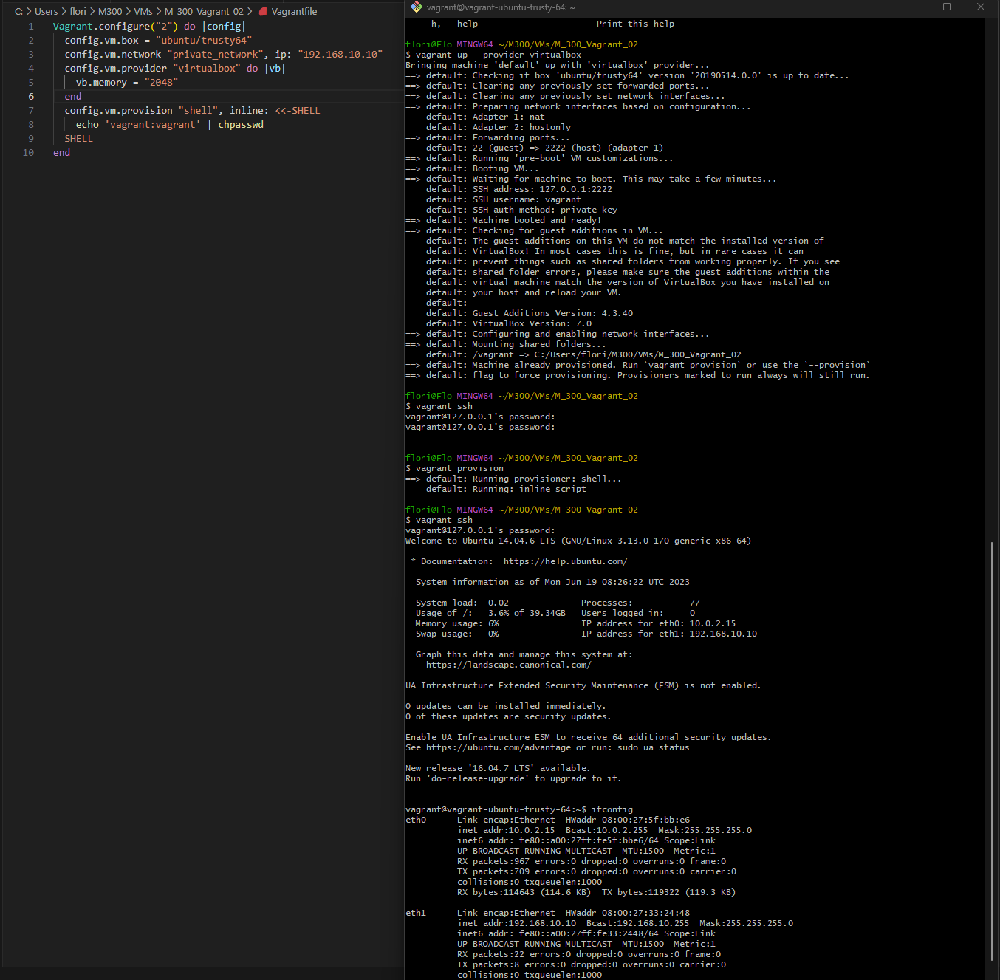

#### Inhaltsverzeichnis

- [Cloud Computing](#cloud-computing)
    - [Arten von Cloud Computing](#arten-von-cloud-computing)
    - [Dynamic Infrastructure Platforms](#dynamic-infrastructure-platforms)
- [Infrastructure as Code](#infrastructure-as-code)
    - [Definition](#definition)
    - [Ziele](#ziele)
    - [Tools](#tools)
- [Vagrant](#vagrant)

# Cloud Computing

Cloud Computing Services Models - IaaS PaaS SaaS Explained

---

Unter **Cloud Computing** (Rechnerwolke) versteht man die Ausführung von Programmen, die nicht auf dem lokalen Rechner installiert sind, sondern auf einem anderen Rechner, der aus der Ferne (remote) aufgerufen wird.

Technischer formuliert umschreibt das Cloud Computing den Ansatz, IT-Infrastrukturen (z.B. Rechenkapazität, Datenspeicher, Datensicherheit, Netzkapazitäten oder auch fertige Software) über ein Netz zur Verfügung zu stellen, ohne dass diese auf dem lokalen Rechner installiert sein müssen.

Angebot und Nutzung dieser Dienstleistungen erfolgen dabei ausschliesslich über technische Schnittstellen und Protokolle sowie über Browser. Die Spannweite der im Rahmen des Cloud Computings angebotenen Dienstleistungen umfasst das gesamte Spektrum der Informationstechnik und beinhaltet unter anderem Infrastruktur, Plattformen und Software (IaaS, PaaS und SaaS).

### Arten von Cloud Computing
***

**Infrastruktur – Infrastructure as a Service (IaaS)**  
Die Infrastruktur (auch "Cloud Foundation") stellt die unterste Schicht im Cloud Computing dar. Der Benutzer greift hier auf bestehende Dienste innerhalb des Systems zu, verwaltet seine Recheninstanzen (virtuelle Maschinen) allerdings weitestgehend selbst. 

**Plattform – Platform as a Service (PaaS)**  
Der Entwickler erstellt die Anwendung und lädt diese in die Cloud. Diese kümmert sich dann selbst um die Aufteilung auf die eigentlichen Verarbeitungseinheiten. Im Unterschied zu IaaS hat der Benutzer hier keinen direkten Zugriff auf die Recheninstanzen. Er betreibt auch keine virtuellen Server.

**Anwendung – Software as a Service (SaaS**  
Die Anwendungssicht stellt die abstrakteste Sicht auf Cloud-Dienste dar. Hierbei bringt der Benutzer seine Applikation weder in die Cloud ein, noch muss er sich um Skalierbarkeit oder Datenhaltung kümmern. Er nutzt eine bestehende Applikation, die ihm die Cloud nach aussen hin anbietet.

Mit dem Advent von Docker (Containierisierung) hat sich zwischen IaaS und PaaS eine neue Ebene geschoben: 

**CaaS (Container as a Service)** 
Diese Ebene ist dafür zuständig, containerisierten Workload auf den Ressourcen auszuführen, die eine IaaS-Cloud zur Verfügung stellt. Die Technologien dieser Ebene wie Docker, Kubernetes oder Mesos sind allesamt quelloffen verfügbar. Somit kann man sich seine private Cloud ohne Gefahr eines Vendor Lock-ins aufbauen.

### Dynamic Infrastructure Platforms
***

Microsoft How does Microsoft Azure work

---

Eine dynamische Infrastruktur-Plattform (Dynamic Infrastructure Platform) ist ein **System**, das Rechen-Ressourcen  virtualisiert und bereitstellt, insbesondere CPU (**compute**), Speicher (**storage**) und Netzwerke (**networks**). 
Die Ressourcen werden programmgesteuert zugewiesen und verwaltet. Die Bereitstellung erfolgt mit virtuellen Maschinen (VM).

Beispiele sind:
*  Public Cloud
    *  *AWS, Azure, Digital Ocean, Google, exoscale*
*  Private Cloud 
    *  *CloudStack, OpenStack, VMware vCloud*
*  Lokale Virtualisierung 
    *  *Oracle VirtualBox, Hyper-V, VMware Player*
*  Hyperkonvergente Systeme 
    *  *Rechner die die oben beschriebenen Eigenschaften in einer Hardware vereinen*

**Anforderungen**
Damit Infrastructure as Code (IaC) auf dynamischen Infrastruktur-Plattformen genutzt werden kann, müssen sie die folgenden Anforderungen erfüllen:
* **Programmierbar**
    * Ein Userinterface ist zwar angenehm und viele Cloud Anbieter haben ein solches, aber für IaC muss die Plattform via Programmierschnittstelle (API) ansprechbar sein.
* **On-demand**
    * Ressourcen (Server, Speicher, Netzwerke) schnell erstellen und vernichtet.
* **Self-Service**
    * Ressourcen anpassen und auf eigene Bedürfnisse zuschneiden.
* **Portabel**
    * Anbieter von Ressourcen (z.B. AWS, Azure) müssen austauschbar sein.
* Sicherheit, Zertifizierungen (z.B. ISO 27001), etc.

# Infrastructure as Code

**Früher**  
In der "Eisenzeit" der IT, waren die IT-Systeme physikalisch an Hardware gebunden. Die Bereitstellung und Aufrechterhaltung der Infrastruktur war manuelle Arbeit. Dabei wurde viel Arbeitszeit investiert, die Systeme bereitzustellen und am Laufen zu halten. Änderungen waren hingegen teuer aufwendig.

**Heute**  
Im heutigen "Cloud-Zeitalter" der IT, sind Systeme von der physikalischen Hardware entkoppelt, sie sind Virtualisiert.
Bereitstellung und Wartung können an Software-Systeme delegiert werden und befreien die Menschen von Routinearbeiten.
Änderungen können in Minuten, wenn nicht sogar in Sekunden vorgenommen werden. Das Management kann diese Geschwindigkeit, für einen schnelleren Marktzugang ausnutzen.

### Definition
***
Infrastructure as Code (IaC) ist ein **Paradigma** (grundsätzliche Denkweise) zur Infrastruktur-Automation basierend auf Best Practices der Softwareentwicklung.

Im Vordergrund von IaC stehen konsistente und wiederholbare Definitionen für die Bereitstellung von Systemen und deren Konfiguration. Die Definitionen werden in Dateien zusammengefasst, gründlich Überprüft und automatisch ausgerollt.

Dabei kommen, von der Softwareentwicklung bekannte, Best Practices zum Einsatz:
* Versionsverwaltung - Version Control Systems (VCS)
* Testgetriebene Entwicklung - Testdriven Development (TDD)
* Kontinuierliche Integration - Continuous Integration (CI)
* Kontinuierliche Verteilung - Continuous Delivery (CD)

### Ziele
***
Ziele von **Infrastructure as a Code** (IaC) sind:
* IT-Infrastruktur wird unterstützt und ermöglicht Veränderung, anstatt Hindernis oder Einschränkung zu sein.
* Änderungen am System sind Routine, ohne Drama oder Stress für Benutzer oder IT-Personal.
* IT-Mitarbeiter verbringen ihre Zeit für wertvolle Dinge, die ihre Fähigkeiten fördern und nicht für sich wiederholende Aufgaben.
* Fachanwender erstellen und verwalten ihre IT-Ressourcen, die sie benötigen, ohne IT-Mitarbeiter
* Teams sind in der Lage, einfach und schnell, ein abgestürztes System wiederherzustellen.
* Verbesserungen sind kontinuierlich und keine teuren und riskanten "Big Bang" Projekte.
* Lösungen für Probleme sind durch Implementierung, Tests, und Messen institutionalisiert, statt diese in Sitzungen und Dokumente zu erörtern.

### Tools
***
Folgende Arten von Tools werden für IaC benötigt:
* **Infrastructure Definition Tools**
    * Zur Bereitstellung und Konfiguration einer Sammlung von Ressourcen (z.B. OpenStack, TerraForm, CloudFormation)
* **Server Configuration Tools**
    * Zur Bereitstellung und Konfiguration von Servern bzw. VMs (z.B. Vagrant, Packer, Docker)
* **Package Management Tools**
    * Zur Bereitstellung und Verteilung von vorkonfigurierter Software, vergleichbar mit einem APP-Store. Bei Linux: APT, YUM, bei Windows: WiX, Plattformneutral: SBT native packager
* **Scripting Tools**
    * Kommandozeileninterpreter, kurz CLI (Command-Line Interpreter / Command-Line Shell), zur Schrittweisen Abarbeitung von Befehlen. Bei Linux, Mac und Windows 10: Bash, bei reinem Windows: PowerShell.
* **Versionsverwaltung & Hubs**
    * Zur Versionskontrolle der Definitionsdateien und als Ablage vorbereiteter Images. (z.B. GitHub, Vagrant Boxes, Docker Hub, Windows VM)

 # Vagrant
 Unter Toolumgebung habe ich bereits eine VagrantVM heruntergeladen und erstellt. Ich werde nun eine weitere erstellen und diese dann bearbeiten. Ich habe sie wie im Screenshot unten aufgesetzt:
 

 Nun habe ich das File verändert. Ich habe festgelegt wie viel RAM, welche IP und welches Passwort die VM hat. Meine Einstellungen habe ich dann überprüft, in dem ich via ssh auf die vm zugegriffen habe, dort musste ich das Passwort eingeben, was funktioniert hat. Anschliessend habe ich mit dem Befehl "ifconfig" die IP geprüft und mit dem Befehl "free -m" den RAM geprüft. Was beides auch richtig war.
 
