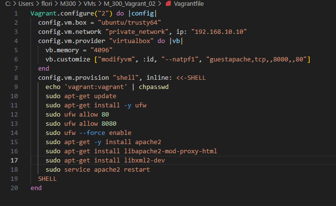
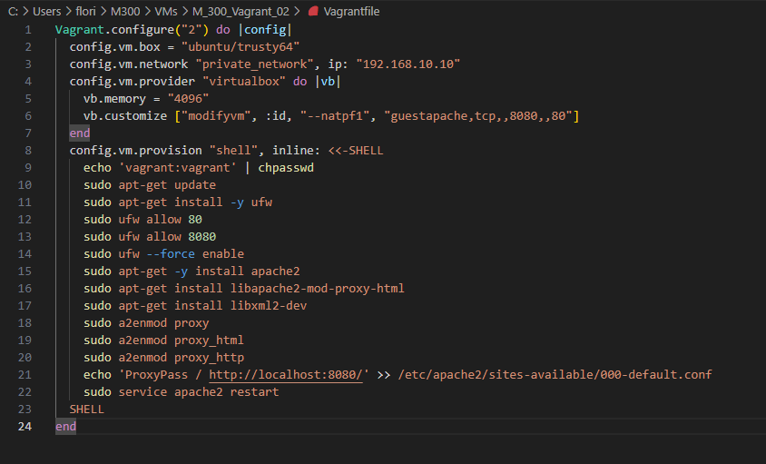

#### Inhaltsverzeichnis

- [Firewall](#firewall)
- [Reverse Proxy](#reverse-proxy)
- [Vergleich Vorwissen](#vergleich-vorwissen)
- [Reflexion](#reflexion)

# Firewall
Bis jetzt sind meine VMs komplett offen gegen aussen. Dies ist in einer produktiven Umgebung, sehr ungüstig, da Angreifer so ganz leicht auf die Umgebung zugreifen könnten. Deshalb kann man die VMs mit einer Firewall absichern. Dies geht wie folgt:

**Ausgabe der offenen Ports**
```Shell
    $ netstat -tulpen
```

**Installation**
```Shell
    $ sudo apt-get install ufw
```

**Start / Stop**
```Shell
    $ sudo ufw status
    $ sudo ufw enable
    $ sudo ufw disable
```

**Firewall-Regeln**
```Shell
    # Port 80 (HTTP) öffnen für alle
    vagrant ssh web
    sudo ufw allow 80/tcp
    exit

    # Port 22 (SSH) nur für den Host (wo die VM laufen) öffnen
    vagrant ssh web
    w
    sudo ufw allow from [Meine-IP] to any port 22
    exit

    # Port 3306 (MySQL) nur für den web Server öffnen
    vagrant ssh database
    sudo ufw allow from [IP der Web-VM] to any port 3306
    exit
```

**Zugriff testen**
```Shell
    $ curl -f 192.168.55.101
    $ curl -f 192.168.55.100:3306
```

**Löschen von Regeln**
```Shell
    $ sudo ufw status numbered
    $ sudo ufw delete 1
```
Und im Vagrantfile sieht dies wie folgt aus:


# Reverse Proxy
Um seine Server noch besser zu schützen, kann man einen Reverse Proxy einrchten. Die Einrichtung geht wie folgt:
**Installation**
Dazu müssen folgende Module installiert werden:
```Shell
    $ sudo apt-get install libapache2-mod-proxy-html --> ist schon im apache2-bin enthalten
    $ sudo apt-get install libxml2-dev
```

Anschliessend die Module in Apache aktivieren:
```Shell
    $ sudo a2enmod proxy
    $ sudo a2enmod proxy_html
    $ sudo a2enmod proxy_http 
```

Die Datei /etc/apache2/apache2.conf wie folgt ergänzen:
```Shell
    ServerName localhost 
```

Apache-Webserver neu starten:
```Shell
    $ sudo service apache2 restart
```

**Konfiguration** <br>
Die Weiterleitungen sind z.B. in `sites-enabled/001-reverseproxy.conf` eingetragen:
```Shell
    # Allgemeine Proxy Einstellungen
    ProxyRequests Off
    <Proxy *>
        Order deny,allow
        Allow from all
    </Proxy>

    # Weiterleitungen master
    ProxyPass /master http://master
    ProxyPassReverse /master http://master
```
Mein Vagrantfile sieht nun wie folgt aus:


# Vergleich Vorwissen
Ich habe davor nichts von Vagrant gewusst. Ich habe immer mühsam meine VMs mit VirtualBox oder dem VMPlayer erstellt. Durch das Modul habe ich nun Vagrant kennen gelernt und gemerkt wie einfach es eigentlich ist, eine VM zu erstellen. Ich werde in Zukunft bestimmt Vagrant oder andere ähnliche Tools benutzen um VMs zu erstellen.
# Reflexion
Ich bin am Anfang nur sehr langsam voran gekommen, da die Umgebung auf meinen Laptop nicht lief. Ich habe sie dann zuhause auf meinen PC eingerichtet und dort lief es dann super. Ich persönlich fand die Vagrant Umgebung aufsetzen nicht sehr spannend und bin deswegen auch nur langsam vorangekommen. Ich glaube das sieht man auch daran, dass ich erst beim letzten mal abgegeben habe. Ich muss in Zukunft schauen, dass auch wenn mir etwas nicht so spass macht, ich versuche trotzdem eine sehr gute Leistung zu erbringen.

[⇧ **Nach oben**](#inhaltsverzeichnis)